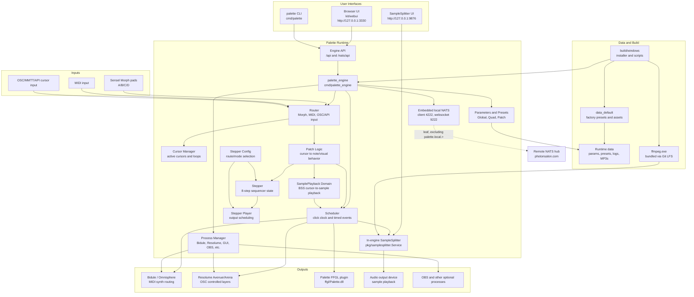

# Palette Architecture

This document summarizes the current Palette system architecture as of May 2026.
It is intended to be a practical map of the moving parts: what runs, what owns
state, how input becomes sound and visuals, and where the main extension points
live.

## System Purpose

Palette is the runtime system for Space Palette Pro and related installations.
It turns multitouch pad gestures into synchronized sound, visuals, loops,
sample playback, preset changes, and process control. The main runtime is a Go
engine that serves a browser UI, receives input from Sensel Morph pads and MIDI,
drives Bidule/Omnisphere by MIDI, drives Resolume/FFGL visuals by OSC, and now
also hosts the Go SampleSplitter service for in-engine SamplePlayback.

## High-Level Diagram

## Runtime Processes

The center of the system is `palette_engine`, built from
`cmd/palette_engine`. It initializes the global runtime objects, starts the HTTP
API and web UI, starts the scheduler, receives input, and coordinates sound,
visuals, looping, sequencing, and process supervision.

`palette`, built from `cmd/palette`, is the command-line control surface. It can
start and stop the system, query status, edit global and per-patch parameters,
load presets, and call the engine API.

`palette_monitor`, built from `cmd/palette_monitor`, is the watchdog process
that can restart the engine if it exits unexpectedly.

The browser UI is no longer a separate Python GUI. The engine embeds and serves
the browser UI from `kit/webui` on port 3330. The process manager can launch a
Chrome app window that points at this local web UI.

Bidule and Resolume are external commercial applications. Palette starts and
monitors them when enabled, sends Bidule MIDI events, and sends Resolume OSC
messages. Resolume hosts `Palette.dll`, the FFGL visual plugin built from the
`ffgl` tree.

SampleSplitter now has two relevant forms:

- The in-engine Go service from `pkg/samplesplitter`, started through
  `global.process.samplesplitter`. This is the path used by Palette
  SamplePlayback.
- The standalone Go executable in `cmd/samplesplitter`, with the same browser
  UI and MIDI-facing behavior for standalone use. The Python implementation is
  retained in `cmd/samplesplitter` as a legacy standalone reference and should
  not be the Palette runtime path.

## Engine Startup

`InitEngine()` creates the core singletons: cursor manager, router, scheduler,
attract manager, stepper, quad, MIDI IO, Erae/Morph input, global params, and
process manager. `Start()` then initializes MIDI and synth definitions, starts
the quad state, opens OSC and HTTP listeners, starts the scheduler, starts
router input, starts MIDI IO, and resets Bidule.

When `palette_engine` is run in `engineonly` mode, the engine runs without
auto-starting the surrounding applications. This is useful for debugging the web
UI and API without launching the full show rig.

## API and Control Model

The engine exposes a JSON API at `http://127.0.0.1:3330/api`. Calls use the
`type.action` form. Major API groups include:

- `global.*` for global parameters, process control, status, boot values, and
  SamplePlayback reloads.
- `quad.*` for loading four-patch presets.
- `patch.*` for loading and editing one or more patch presets.
- `saved.*` for listing saved presets and parameter definitions.
- `cursor.*` for cursor injection and test paths.
- `stepper.*` for sequencer commands such as route selection, playback,
  recording, and track clearing.

The CLI is mostly an API client. Browser UI actions also flow through this API,
which keeps the web UI thin and makes most behavior scriptable from the command
line. Live UI state is not exposed through polling-oriented HTTP endpoints; the
browser receives status, cursor activity, OBS recording state, and stepper state
from the embedded local NATS feed.

## Parameters, Presets, and Data

Palette state is parameter-driven. Parameter definitions and enums define the
legal names, types, defaults, and UI metadata. Runtime values are held in
`GlobalParams`, patch params, and quad/preset structures.

Important saved data categories are:

- Global parameters, including process enable flags, logging, GUI mode,
  SamplePlayback settings, and boot-time defaults.
- Quad presets, which describe all four patches as a single performance state.
- Patch presets, which describe sound, visual, effect, and miscellaneous
  behavior for a single pad.
- Factory defaults under `data_default`.
- Per-user mutable runtime data, including saved params, copied defaults, logs,
  SampleSplitter MP3s, and current state.

The browser UI can show either preset grids or parameter editors for each
category. Patch commands support single patches and all-patch operations.

## Input Flow

Physical pad input enters through the router as cursor events. Palette also has
paths for MIDI input and OSC/API-originated cursor input. The router normalizes
these sources into the same runtime flow where possible.

The cursor manager tracks active touches and their associated state. A cursor
event is then interpreted by patch logic for the relevant A/B/C/D pad. Patch
logic decides whether that cursor is controlling the normal Oscillation/Synth
path, the BSS SamplePlayback path, visual output, recording into Stepper, or some
combination of those.

## Timing and Scheduling

The scheduler is the timing heart of the engine. It advances a click clock,
triggers events scheduled for specific clicks, advances the stepper, checks
process state, and runs periodic managers. It is intentionally central because
Palette needs MIDI, sample playback, visual changes, looping, and sequencer
steps to share one timeline.

Scheduled item types include MIDI notes, note-offs, pitch bends, sample playback
starts and stops, sample pitch events, stepper sample stops, and other engine
control events.

## Sound Output

The traditional sound path schedules MIDI events to Bidule/Omnisphere. Patch
parameters determine synth selection, pitch, velocity, channel, and gesture
behavior. Bidule receives MIDI through configured virtual MIDI ports, typically
LoopBe30 on Windows.

SamplePlayback is the newer direct sample path. In BSS, when a pad is
in the UI's Transmission mode, cursor gestures are interpreted by `SamplePlaybackDomain`
instead of being sent only as normal synth notes. Horizontal finger position
selects the sample, vertical position controls pitch bend, and pressure controls
volume. Playback is quantized according to the SamplePlayback quantization
parameter. The scheduler sends the resulting sample start, pitch, and stop
events to the in-engine SampleSplitter service.

The in-engine SampleSplitter service owns the actual MP3 analysis, splitting,
optional compression/normalization, peak-position playback, and audio device
output. It uses the bundled `ffmpeg.exe` to decode MP3 input and the Go audio
backend for playback.

## Visual Output

Visuals are generated from the same cursor and patch state as sound. Patch logic
sends OSC messages to Resolume and to the Palette FFGL plugin. The FFGL plugin
draws and animates sprites/shapes while Resolume hosts the larger layer/effect
pipeline.

Each A/B/C/D patch maps to an independent visual layer. Patch and effect
parameters control shape, color, sizing, fades, z behavior, and Resolume effect
parameters. In the UI's Transmission mode, the visual shape can be forced to the sigil
for the corresponding pad while preserving the currently selected preset's other
sound and effect settings.

## Looping

The original looping system records and replays cursor gestures and related
scheduled behavior over the global loop length. Loop timing is defined in click
space, with beat-based quantization derived from global loop parameters.

For normal Oscillation/Synth behavior, the loop records cursor-driven notes and
visual behavior through the existing scheduling infrastructure. This is why the
loop can affect both audio and visuals without a separate sequencer path.

SamplePlayback has been integrated with this same timing model at the
Palette layer. Sample starts are quantized to the selected SamplePlayback
quantization interval, and the sample voice lifecycle is explicit so old/stale
stop events cannot terminate a newer voice for the same pad.

## Stepper Sequencing

Stepper is the grid sequencer used by the Sequencer page. Internally it is named
`Stepper`, with `stepper.*` parameter names. It has four tracks mapped to
patches A/B/C/D and currently uses 8 steps across `global.looping_beats`.

Stepper records notes generated from pad gestures when sequencing is enabled.
Events are quantized to the nearest step. Each step can hold the notes generated
during that step. Stepper playback is separated from Stepper sequencing:

- `Stepper` owns track state, recording, step timing, and status.
- `StepperConfig` owns route and mode configuration.
- `StepperPlayer` owns output scheduling to Bidule and/or samples.

Routes can be off, Bidule, SampleSplitter, or both. Stepper sequencing is
disabled on the BSS initial page because BSS SamplePlayback behavior is direct
cursor-to-sample playback rather than grid recording.

## SamplePlayback and SampleSplitter

The SamplePlayback domain is Palette-facing and lives in `kit/sample_playback.go`.
It translates BSS cursor events into sample playback intent. It does not split
audio itself; it uses the SampleSplitter service as the playback engine.

SampleSplitter itself lives in `pkg/samplesplitter`. It is responsible for:

- Finding and loading MP3 files.
- Splitting audio into chunks by words or other supported split modes.
- Using the peak position of the first word when peak playback is enabled.
- Optional compression and normalization.
- Mapping chunks to MIDI notes for standalone use.
- Exposing a browser UI/API on port 9876.
- Playing audio directly through the selected output device.

Palette uses the in-engine service directly for SamplePlayback, with MIDI
disabled for that path. The standalone Go SampleSplitter still supports MIDI
triggering for independent testing and non-Palette use.

## Web UI Architecture

The browser UI is embedded into the engine binary from `kit/webui`. After
editing files in that directory, `palette_engine` must be rebuilt.

The UI is split into small browser modules:

- `api.js` wraps engine API calls.
- `state.js` owns UI state, selected mode, current category, patch selection,
  cursor activity, stepper timing, and initial page normalization.
- `render.js` owns DOM rendering helpers.
- `local_nats.js` wraps the vendored `nats.ws` browser client and maintains the
  browser's local NATS-over-WebSocket connection.
- `subjects.js` centralizes the local NATS subjects used by the UI.
- `routes.js` centralizes Stepper/SamplePlayback route wire values and labels.
- `ui_nats.js` owns the browser subscription and startup snapshot plumbing.
- `app.js` coordinates startup, event handlers, push-event handling, API
  actions, and page transitions.

The web UI no longer runs recurring HTTP polls. Engine state used by the UI is
published locally on NATS subjects under `palette.local.ui.*`, and startup state
is fetched with a local NATS request to `palette.local.ui.snapshot.request`.
The embedded NATS leaf configuration keeps those subjects local-only.

Current UI concepts include the original Space Palette Pro page, the Sequencer
page, and the newer BSS page controlled by `global.mode` values `pro`
and `bss`. The BSS UI presents virtual pads, Prophecy/Oscillation
mode toggles, SamplePlayback controls, and Oscillation/Photonic preset controls.

## Process Management

`ProcessManager` tracks named processes such as `gui`, `bidule`, `resolume`,
`obs`, `samplesplitter`, `chat`, and `mmtt`. Process enable flags are normal
global parameters such as `global.process.resolume`.

Most managed processes are external executables. `samplesplitter` is a special
case: the preferred Palette runtime starts the in-engine Go SampleSplitter
service rather than launching a separate Python or Go executable. Process status
therefore checks whether the SampleSplitter web/API service is listening.

## Build, Install, and Test

Windows build scripts live under `build/windows`. The normal full workflow
builds the Go executables, copies runtime assets, packages installers, and
stages the per-user install layout. `doit.bat` is the local build/install/run
convenience entry point and should be run from `build/windows`.

`testit.bat` runs the current minimal test suite for the build, including Go
tests and the web UI smoke test. The smoke test is implemented in
`build/webui_smoke_test.mjs` and can optionally require a live engine.
Manual diagnostic commands such as `cmd/miditest` are intentionally kept out of
the regression test path because they depend on local MIDI hardware and driver
state.

The build includes only `ffmpeg.exe` from the SampleSplitter ffmpeg directory.
That executable is tracked with Git LFS so fresh clones can obtain it without
checking a large binary directly into normal Git object storage. Build scripts
check that the LFS-backed file is actually present and not just an unresolved
pointer.

## Logging and Diagnostics

Logging is controlled by the `global.log` parameter. Log categories include API,
config, params, patch, load, cursor, gesture, loop, MIDI, note, process,
attract, Bidule, FFGL, and others. `*` enables all log types. Logs are written
to `engine.log` in the runtime logs directory.

Useful diagnostic surfaces include:

- `palette status` for process and runtime state.
- `palette get`, `palette set`, `palette patchget`, and `palette patchset` for
  parameter inspection and edits.
- `http://127.0.0.1:3330/api` for direct engine calls.
- `http://127.0.0.1:9876` for SampleSplitter state and controls.
- The browser UI smoke test for checking that the web UI loads and key controls
  render.

## Important Boundaries

The engine owns performance timing, parameters, routing, and the canonical
Palette behavior. External applications are treated as controllable endpoints:
Bidule for synth sound, Resolume/FFGL for visuals, OBS for optional capture, and
standalone SampleSplitter only when running outside the integrated path.

The web UI should stay a client of the API rather than owning performance
logic. Sample splitting and audio playback should stay inside
`pkg/samplesplitter`, while Palette-specific decisions such as pad mode,
quantization, cursor mapping, and loop integration should stay in the `kit`
domain layer.

This separation is what allows the same SampleSplitter implementation to serve
both standalone MIDI use and in-engine SamplePlayback without forcing Palette to
route its own sample gestures through MIDI.
