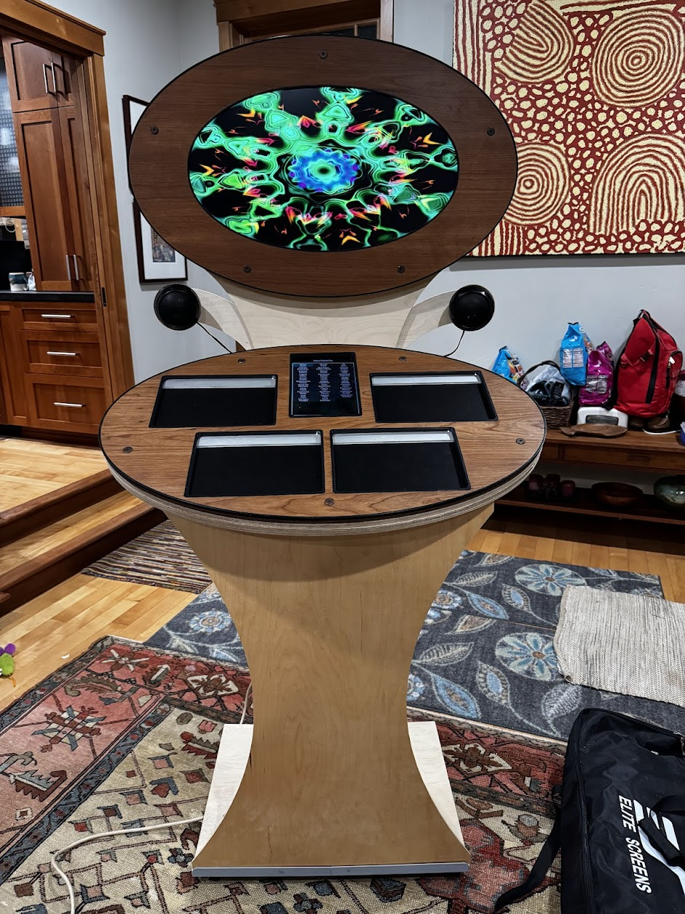
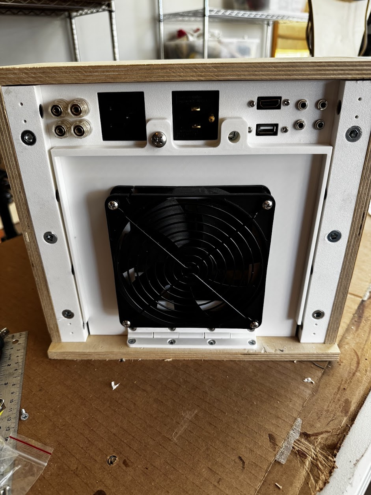
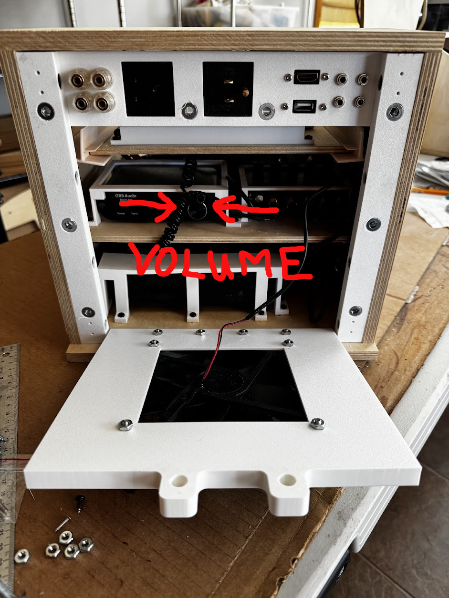
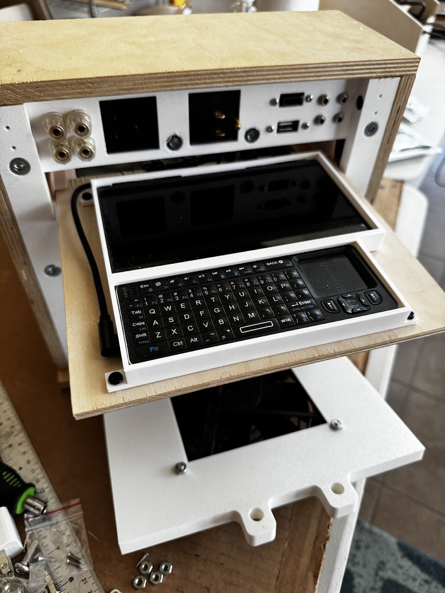

# Maintaining the Space Palette

This document describes how to maintain the Space Palette Pro; this is the version of the
Space Palette that uses the pressure-sensitive Sensel Morph pads.  Here is an album of pictures showing the modular construction of the latest version:  https://photos.app.goo.gl/Jf1TQwoNzTAQnGq16

#
# All you really need to know

   - To check that it's working, use the touchscreen to select one of the presets,
   and then fingerpaint on each of the 4 pads to make sure they're responding.

   - It can be left on 24/7.  If you want to turn it off, just unplug it from power.
  To turn it back on, plug it back into power, and it should restart automatically,
  becoming fully operational in a couple minutes.

   - If any of the pads aren't responding, or if the touchscreen isn't responding,
   or if there is any other issue, just turn it off and back on.
   It should come back and be working in a couple minutes.

   - If turning if off/on doesn't resolve a problem,
   feel free to contact me - Tim Thompson, me@timthompson.com, 1-408-644-8593.
   I can connect to it remotely and resolve most issues.

#
# Controlling the volume

   - The headphones have volume controls on their cords.  It's a small dial that you rotate with your fingers - rotating it toward the headphones increases the volume.

   - The speaker volume is independent of the headphone volume.  The headphones are always on, but you can adjust the speaker volume as desired, even all the way off if you want.

   - Here's the back panel.  By removing the thumbscrew holding it in,
   you can fold down the back panel to reveal the internals.
   The big knob in the middle is the volume control.

#
# Connecting to Wifi, accessing the internal keyboard and display

   - You should very rarely need to access the keyboard and display.
   The most common need for this will be to adjust the Wifi settings in order to reconnect it to a network if the network has changed.

   - Once you have the back panel folded down, you can pull out the sliding tray that holds a tiny keyboard and monitor.  You many need to press the "Fn" key in the lower left corner of the keyboard to wake it up.  Worst case, you can connect a USB keyboard to the USB port at the top of the back panel (next to the headphone jacks).

#
# Licenses and contact info

   - There are several software licenses that may occasionally need to be renewed.  These are:
Omnisphere (the software synth that makes most of the sounds),
Plogue Bidule (the VST host), and Resolume (the visual software).  Tim will normally manage these remotely.

   - Any questions, contact Tim Thompson - 1-408-644-8593, me@timthompson.com, 943 Willow Glen Way, San Jose, CA, 95125