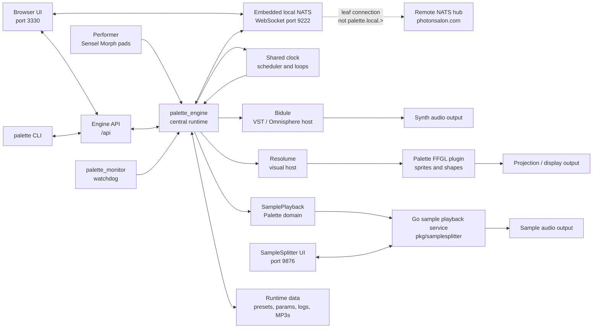

# Palette System Overview

This is the high-level view of the major Palette components and how they fit
together. For a deeper code-level map, see `architecture.md`.

## Major Components

Palette is a local performance system made of one central engine plus several
specialized programs around it.

`palette_engine` is the hub. It receives input from the Sensel Morph pads and
other control sources, keeps the performance clock, schedules events, manages
presets and parameters, serves the browser UI, and sends control messages to
the sound and visual systems.

The browser UI is the main human control surface. It is served by the engine at
`http://127.0.0.1:3330/`, sends user actions through the local API, and receives
live UI state over the embedded local NATS WebSocket using the vendored
`nats.ws` browser client. It is used for preset selection, parameter editing,
pad mode selection, SamplePlayback controls, and sequencer views.

The engine also embeds a local NATS server. It listens on `127.0.0.1:4222` for
local NATS clients and `127.0.0.1:9222` for browser WebSocket clients. When
`NATS_URL` is configured, this embedded server creates an outbound leaf
connection to the remote hub. The `palette.local.>` subject namespace is denied
on the leaf connection and is reserved for local GUI-engine traffic, including
the UI startup snapshot request and live `palette.local.ui.*` updates.

Bidule is the main synth host. Palette sends MIDI to Bidule, and Bidule routes
that MIDI to Omnisphere instances and other synth/effect chains.

Resolume is the visual host. Palette sends OSC control data to Resolume and to
the Palette FFGL plugin running inside Resolume. Resolume then renders and
processes the visual layers.

SamplePlayback is the Palette-facing sample domain. In the normal Palette
runtime it is backed by an in-engine Go service from the SampleSplitter package,
driven directly by cursor events rather than MIDI.

`palette` is the command-line tool. It controls the engine through the same API
used by the browser UI, so most UI actions can also be scripted.

`palette_monitor` is the watchdog. It can restart the engine if the engine
crashes or exits unexpectedly.

## Component Diagram

## Primary Data and Control Flows

### Pad Gesture to Synth Sound

1. The performer touches or moves on a Sensel Morph pad.
2. `palette_engine` receives that as cursor input.
3. The engine applies the current patch and preset parameters.
4. The scheduler quantizes or delays events as needed.
5. MIDI is sent to Bidule.
6. Bidule plays the configured Omnisphere/synth sound.

### Pad Gesture to Visuals

1. The same cursor input is interpreted for visuals.
2. The engine sends OSC messages for the matching A/B/C/D visual layer.
3. Resolume receives the control data.
4. The Palette FFGL plugin draws the shape or sigil.
5. Resolume applies the rest of the visual effect chain and outputs the image.

### Pad Gesture to SamplePlayback

1. A pad is set to Transmission mode in the browser UI.
2. The performer touches or moves on that pad.
3. The engine maps horizontal position to sample selection, vertical position to
   pitch bend, and pressure to volume.
4. Playback starts are quantized by the engine scheduler.
5. The in-engine sample playback service plays the selected audio chunk.

### Browser or CLI Control

1. The browser UI or `palette` CLI sends an API request.
2. The engine updates parameters, presets, process state, or sequencer state.
3. The changed state immediately affects subsequent input and playback.
4. Some global process parameters can start or stop external programs such as
   Bidule, Resolume, OBS, and the sample playback service.

## Runtime Shape

In the usual installed system, the user starts Palette through the CLI or a
script. The engine then becomes the live coordinator. The UI is just a browser
client of the engine, while Bidule, Resolume, and the sample playback service
are specialized endpoints controlled by the engine.

The most important architectural boundary is that timing and performance logic
belong to `palette_engine`. The UI edits state, Bidule makes synth sound,
Resolume makes visuals, and SamplePlayback plays chunks of audio, but the
engine decides what should happen and when.
