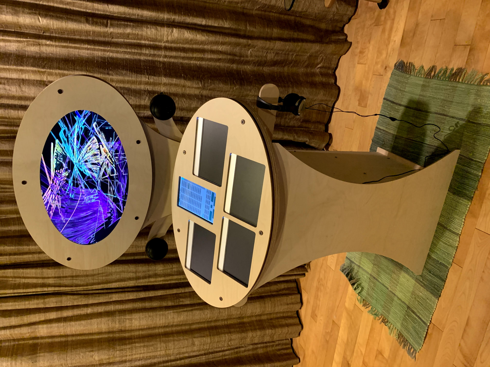

<h1>Space Palette Pro</h1>

&nbsp;&nbsp;

NOTE: This repo is undergoing a massive rework for a more modular physical arrangement; the single monolithic
enclosure will be broken up into sections - one "core" section with all the electronics, and the other sections
will merely be support.  Besides being much easier to transport, it will also allow a desktop configuration.
The controller and monitor parts will be largely unchanged.

This repo contains open-source specs allowing you to completely reproduce the Space Palette Pro,
a visual music instrument on which you play music and graphics simultaneously by finger painting on
pressure sensitive pads.  Here are some <a href="https://photos.app.goo.gl/1x5BrCuc9yP6Z52XA">photos and videos</a> from a recent event where it was enjoyed.  Here is a <a href="https://youtu.be/HDtxEyCI_zc?t=362">improvised performance</a> using it.

Questions welcome, you can either submit an issue or email me@timthompson.com (aka <a href="https://nosuchtim.com">nosuchtim</a>)

<!--
<h2>Getting started with a single Morph as a visuals-only instrument</h2>

If you have Windows 10 and a Sensel Morph,
you can easily run the Palette software
as a visuals-only instrument with Resolume 7,
without building the complete Space Palette Pro.
It will even work with the demo version of Resolume Avenue or Arena.
Here are the instructions for
<a href="https://github.com/vizicist/palette/blob/main/doc/using_resolume.md">using a single Morph as a visuals-only instrument</a>.
-->

<h2>Building just the Space Palette Pro controller</h2>

Here are the instructions for <a href="doc/building_controller.md">building just the controller</a>,
which by itself would work well in many situations, for example doing performances.
In addition to 4 Morphs, you need the wood pieces, 2 USB hubs, the 10.1" touchscreen, and cables.

<!--
<h2>Building a complete and standalone Space Palette Pro</h2>

NOTE: If you plan on building a complete standalone Space Palette Pro, please send email to me@timthompson.com before starting,
since there have been major changes to the design of the base.

Here are the instructions for <a href="doc/building.md">building a complete and standalone Space Palette Pro</a> from scratch.
The cost of all the <a href="doc/parts.pdf">raw materials</a> for an uncompromised and complete instrument
including the computer is around $8K.
This is no-compromise single-item pricing of all materials - cost-reductions
and other adjustments are certainly possible.
For example, the speaker system is unnecessary
if you already have an amplifier and speakers.
Four sets of headphones and a headphone amp may not be needed either.
You might have access to a large CNC machine so you can avoid
paying someone else to CNC all the wood.

-->

<h1>Documentation</h1>
<a href="doc/README.md">Other documentation and important links can be found here.</a>

Any questions, email <a href="mailto:me@timthompson.com">me@timthompson.com</a>
