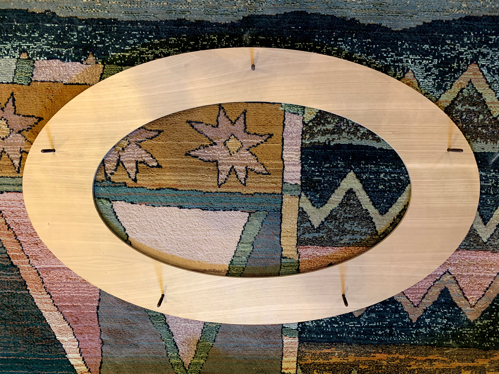
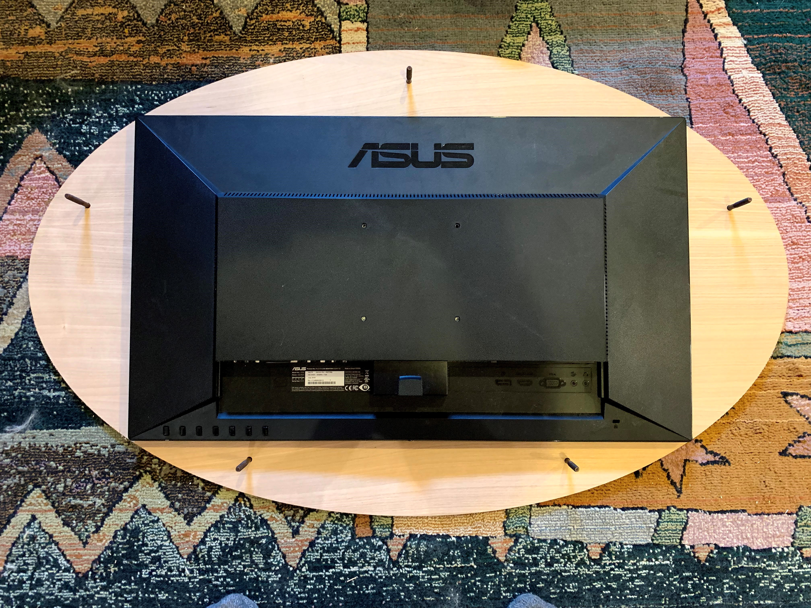
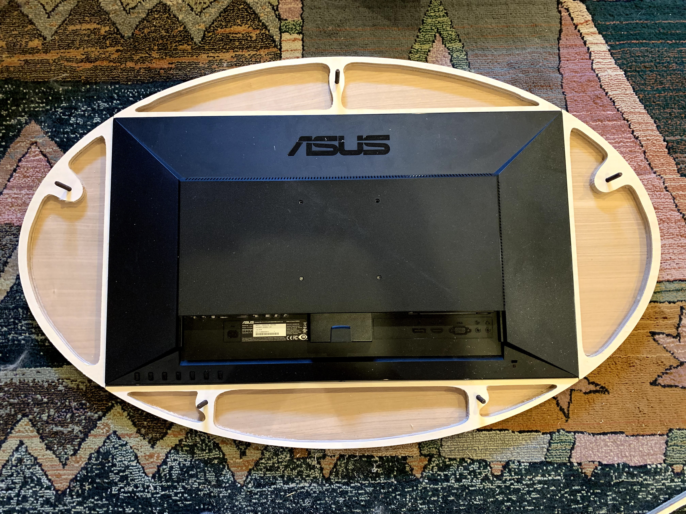
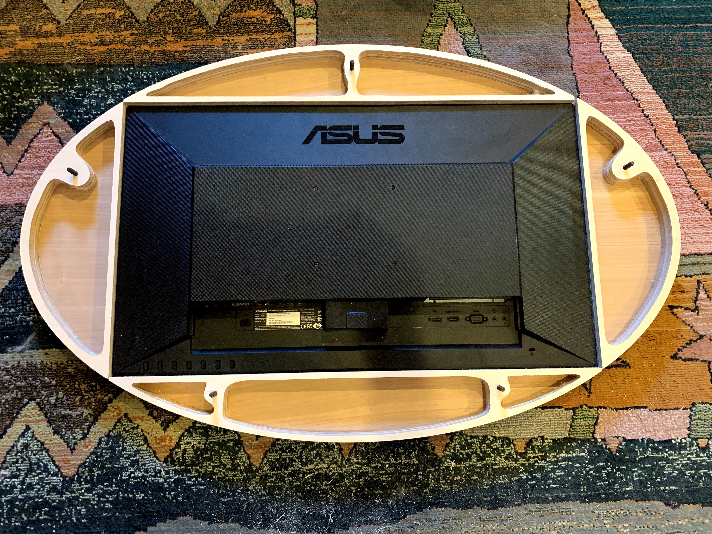
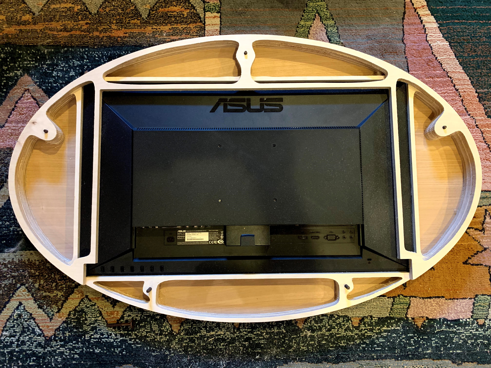
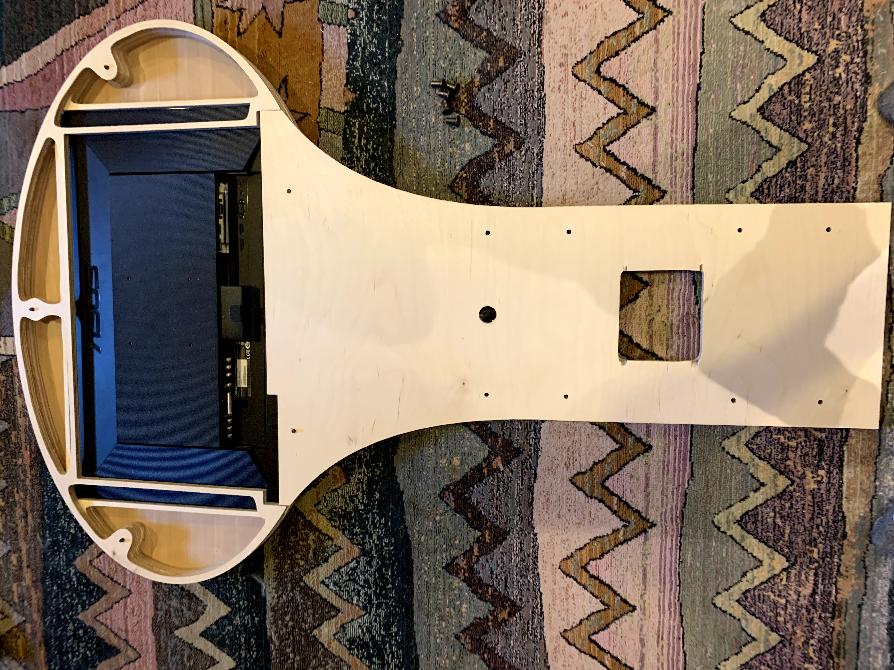
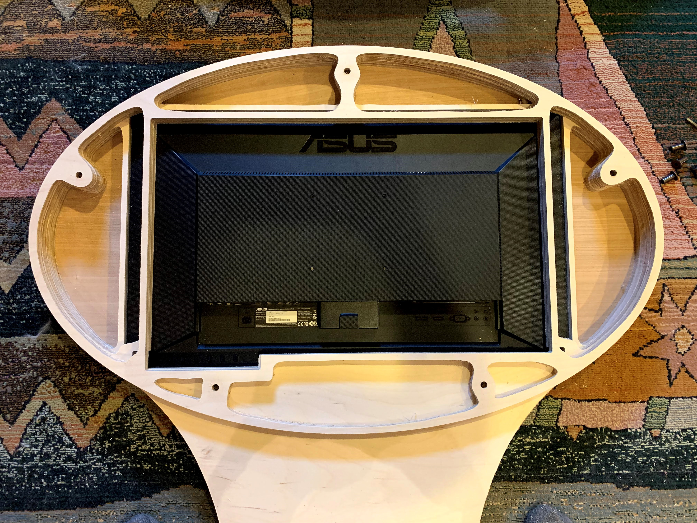
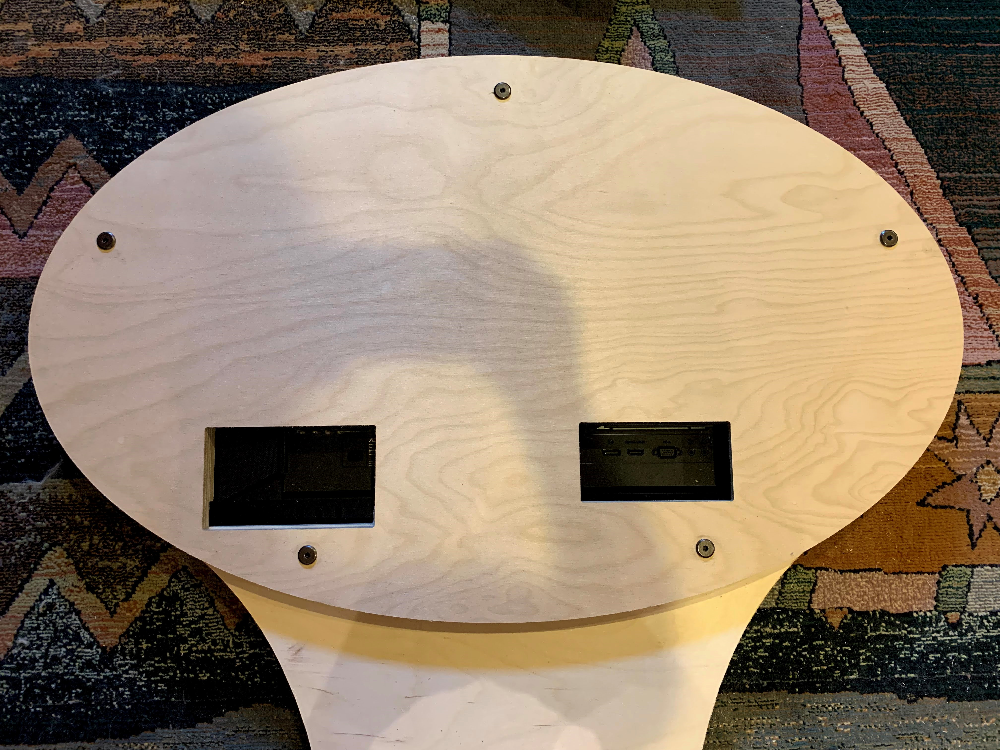

<h1>Building the Monitor of the Space Palette Pro</h1>
Use the longer 1.97-inch connector bolts, and put the first layer face-down.
 
 
Put the monitor in place.
 
 
The next two layers are each composed of four separate pieces arranged around the monitor.
The fit is tight, and assumes the specific model of monitor identified in the parts list.
 
 
 
The next layer is three-sided, the open side should be at the bottom.
 
 
When adding the BaseBack layer, be sure to get the left/right orientation correct.
 
 
Again, be sure to get the left/right orientation correct, so that the buttons toward
the left side of the monitor can be accessed.
 
 
Add the final back.
 
